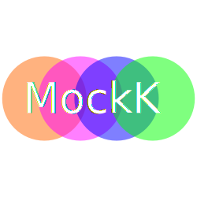

    

 

# [Getting Started Guide](https://mockk.io/docs)

# Getting Help

To ask questions, please use GitHub Discussions.

To report bugs, please use GitHub Issues.

# Contributors

Thanks to everyone who has contributed code, documentation, and ideas to make MockK better.

# Backers

Thank you to all our backers who support MockK's development through financial contributions.

# Sponsors

Special thanks to our sponsors whose generous support helps sustain and advance the MockK project.

